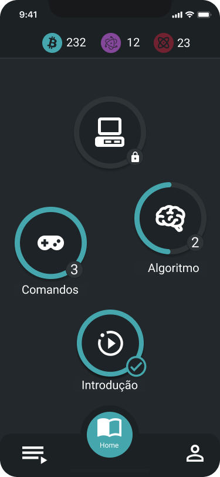

## Documentação
O aplicativo é composto por mapas, fases, atividades e aulas. 

- Os mapas são sessões de estudo com uma ou duas metas de estudo, por exemplo, manipular strings. 
- As fases são composta por diversas atividades que serão usadas repetitivamente para cumprir a meta do mapa.
- As atividades são problemas pequenos e especifico que vai ajudar o aluno a praticar o conteúdo do fase.
- As aulas são um artigos escritos escritos em markdown que descrevem o conteúdo do mapa.

## Diagrama
o diagrama pode ser encontrado [aqui](https://lucid.app/lucidchart/baa3fd86-d248-40fc-898b-3eaa7da3ac6d/edit?invitationId=inv_4310d971-d43b-46f6-85b5-1221de03e802).

## Fases vs Aulas
A table `phases` tem uma coluna chamada `type`, essa é responsável por diferenciar uma fase teórica (aula) de uma fase pratica (fase normal composta por atividades). Portanto, as fases do tipo teórica serão fases que não possuem nenhuma atividade, apenas o texto markdown na coluna chamada `markdown_text`. Já as fases práticas possuem um relacionamento `one to many` com as atividades, e não tem um `markdown_text`.

**Diferença visual**
Ao mostrarmos as fases no aplicativo, a única diferença de uma fase e uma aula será o ícone, abaixo o circulo "introdução" é uma aula e os outros são fases:

